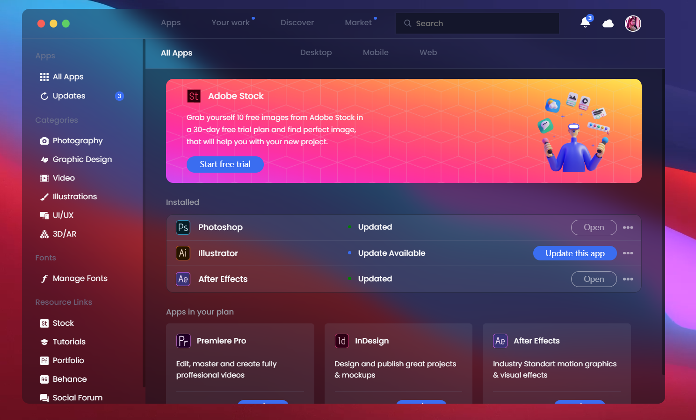
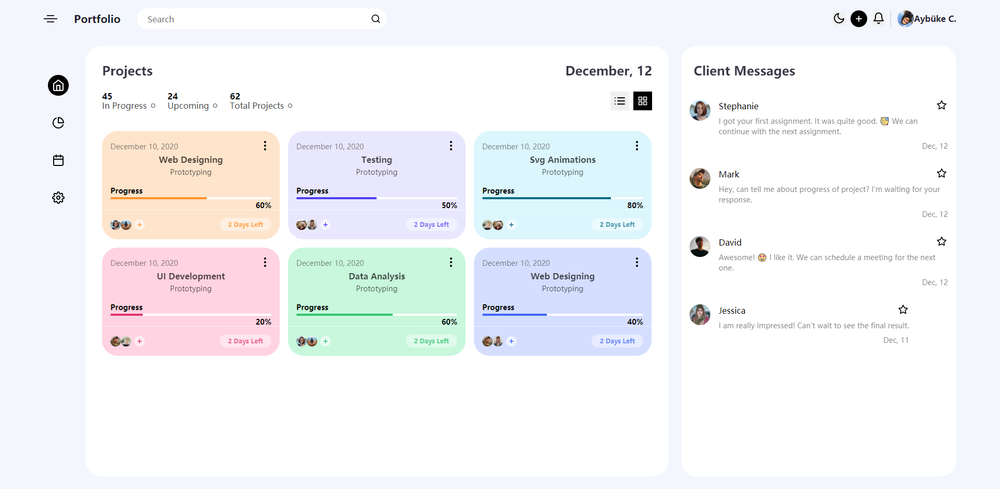
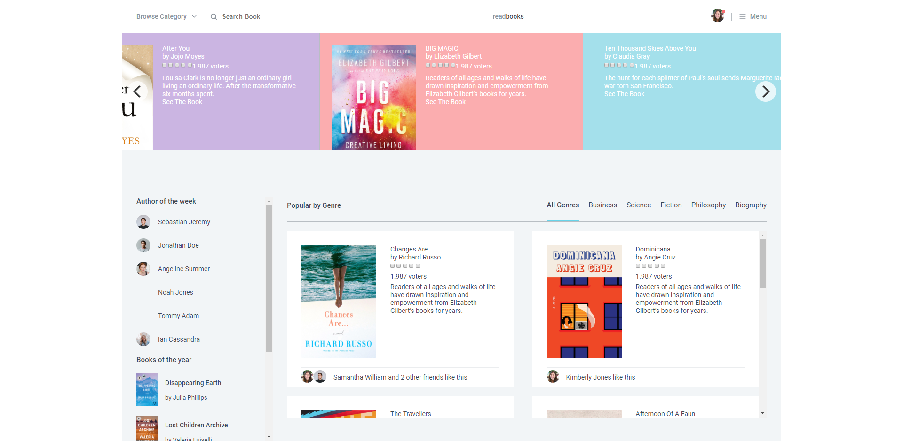
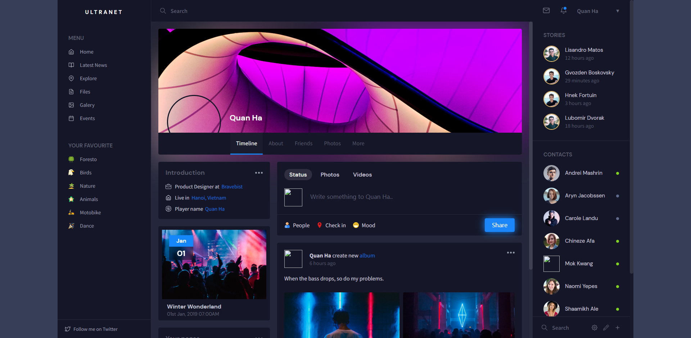

# Static-website-exercise
Several elegant static website exercises to help you improve your CSS skills

# 基础

[50 Projects in 50 Days](https://github.com/bradtraversy/50projects50days)

# 目标

- [x] 练习CSS知识点，熟悉CSS属性和基本布局
- [x] 能够还原设计页面，巩固前端基础

# glassmorphism-creative-cloud-app-redesign

# project-management-dashboard-ui

# book-store-ui

# responsive-social-platform-ui

练习页面的来源: [CodePen](https://codepen.io/)
