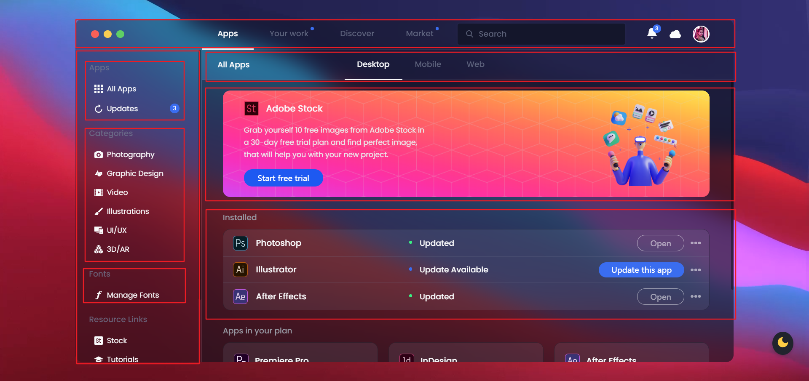

# 页面整体架构

```html
<div class="app">
  <div class="header">
    <div class="menu-circle"></div>
    <div class="header-menu"></div>
    <div class="search-bar"></div>
    <div class="header-profile"></div>
  </div>
  <div class="wrapper">
    <div class="left-side">
      <div class="side-wrapper">
        <div class="side-title">Apps</div>
        <div class="side-menu"></div>
      </div>
      <div class="side-wrapper">
        <div class="side-title">Apps</div>
        <div class="side-menu"></div>
      </div>
    </div>
    <div class="main-container">
      <div class="main-header">
        <div class="header-menu"></div>
      </div>
      <div class="content-wrapper">
        <div class="content-wrapper-header">
          <div class="content-wrapper-context"></div>
        </div>
        <div class="content-section"></div>
      </div>
    </div>
  </div>
</div>
```

# CSS书写顺序

1. 布局（flex居多，position，float，overflow）
2. 盒子模型（width，height，padding，margin，max-width，max-height）
3. 字体/文本相关（font-size，font-weight，white-space，line-height）
4. 颜色相关（color，background）
5. 变化相关（transform，transition，animation）

# 页面布局图



# 命名的学习

```html
app
	header
		menu-circle
		header-menu
		search-bar	
		header-profile
			notification
			profile-img
	wrapper
		left-side	
			side-wrapper
				side-title
				side-menu
			side-wrapper
			side-wrapper
			side-wrapper
		main-container
			main-header	
				menu-link-main
				header-menu
			content-wrapper
				content-wrapper-header
				content-section
					content-section-title
					adobe-product
				content-section
					content-section-title
					app-cards
						app-card
```


# 宽高的设置

width 一般设置成 百分比%，height 可以设置成 vh 和 px 这种固定单位的，max-width 和 max-height 用来限制盒子的宽高。

# 伪元素定位常用属性

```html
伪元素常用绝对定位 
{ 
    position: absolute; 
    width: 16px; 
    height: 16px;
    border-radius: 50%; 
    top: -6px; 
    right: -6px; 
	/*字体颜色相关*/
    font-size: 10px; 
    color: #fff;
    background-color: #3a6df0; 
	/*伪元素当中有内容用来居中文字的*/
    display: flex; 
    justify-content: center; 
    align-items: center;
} 
```

# 弹性元素

```html
常用布局，一边固定宽度或者高度，一边自适应
由于flex-grow 默认为0 flex-shrink 默认为1 
因此在弹性盒子中，固定一个弹性元素宽度不变：flex-basis: ***px;flex-shrink: 0;
与之配套的就是flex-grow: 1，宽度自适应。
```

# 模仿mac系统三个小圆点

```html
三个小圆点
.menu-circle {
  width: 15px;
  height: 15px;
  border-radius: 50%;
  margin-right: 195px;
  background-color: #f96057;
  box-shadow: 24px 0 0 0 #f8ce52, 48px 0 0 0 #5fcf65; /*太妙了，利用box-shadow在右边新建两个原点*/
  flex-shrink: 0;
}
```

# input样式书写

```html
input的样式可以学习
外层div的作用是设置一个padding-left，使得搜索框与外部元素有了距离，而且display为flex，让搜索框能够设置宽高。
<div class="search-bar">
	<input type="text" placeholder="Search" />
</div>
.search-bar {
  height: 40px;
  padding-left: 16px;
  display: flex;
  width: 100%;
  max-width: 400px; /*先设置width，然后在设置最大宽度*/
  border-radius: 4px;
}
/*设置input的样式思路：先设置padding和width,在设置font，然后在设置背景图片生成搜索图标*/
.search-bar input {
  padding: 0 20px 0 40px;  /*很重要，腾出位置给background-image*/
  width: 100%;
  height: 100%;
  background-color: var(--search-bg);
  font-family: var(--body-font);
  font-size: 15px;
  font-weight: 500;
  box-shadow: 0 0 0 2px rgba(134, 140, 160, 0.02);
  background-image: url("data:image/svg+xml;charset=UTF-8,%3csvg xmlns='http://www.w3.org/2000/svg' viewBox='0 0 56.966 56.966' fill='%23717790c7'%3e%3cpath d='M55.146 51.887L41.588 37.786A22.926 22.926 0 0046.984 23c0-12.682-10.318-23-23-23s-23 10.318-23 23 10.318 23 23 23c4.761 0 9.298-1.436 13.177-4.162l13.661 14.208c.571.593 1.339.92 2.162.92.779 0 1.518-.297 2.079-.837a3.004 3.004 0 00.083-4.242zM23.984 6c9.374 0 17 7.626 17 17s-7.626 17-17 17-17-7.626-17-17 7.626-17 17-17z'/%3e%3c/svg%3e");
  background-repeat: no-repeat;
  background-size: 14px;
  background-position: 16px 48%;
  color: var(--theme-color);
}
```

# 猫头鹰选择器

```html
/*猫头鹰选择器：选择第二个到最后一个元素 */
.side-wrapper + .side-wrapper {
  margin-top: 20px;
}
```

# 滚动条

```html
::-webkit-scrollbar——整个滚动条。
::-webkit-scrollbar {
    width: 6px;   /*控制宽度*/
    border-radius: 10px;
}

::-webkit-scrollbar-thumb——滚动条上的滚动滑块。
::-webkit-scrollbar-thumb {
    background: var(--scrollbar-bg);   /*控制背景颜色*/
    border-radius: 10px;
}
```

# 下拉框

```html
<div class="menu">
    <button class="dropdown">
        <ul>
            <li><a href="#">Go to Discover</a></li>
            <li><a href="#">Learn more</a></li>
            <li><a href="#">Uninstall</a></li>
        </ul>
    </button>
</div>    
/*这个的目的是增大鼠标点击面积*/
.dropdown {
  position: relative;
  height: 53px;
  width: 40px;
  top: -24px;
  left: -5px;
  display: flex;
  background: transparent;
  border: none;
  cursor: pointer;
}
/*整个下拉框ul先设置opacity为0，鼠标事件对它无效*/
.dropdown ul {
  position: absolute;
  top: 20px;
  right: 0;
  width: 120px;
  height: 110px;
  padding: 0;
  border-radius: 14px;
  opacity: 0;
  pointer-events: none; /*不触发鼠标事件 与 opacity 为0 一起用*/
  background-color: var(--dropdown-bg);
  transform: translateY(10px);
  transition: all 0.4s ease;
}
/*点击之后opacity设置为1，鼠标事件有效*/
.dropdown.is-active ul {
  pointer-events: all;
  opacity: 1;
  transform: translateY(25px);
}
```

# 图片新属性

```html
img {
  max-width: 100%;
}
.content-wrapper-img {
  width: 186px;
  object-fit: cover;   
  margin-top: -25px;
  object-position: center;
}

object-fit CSS 属性指定可替换元素（例如： 或
<video>）的内容应该如何适应到其使用高度和宽度确定的框。</video>
object-fit: fill | contain | cover | none | scale-down; 例如：
```

# 三列布局

```html
<div class="apps-card">
    <div class="app-card">
    </div>
    <div class="app-card">
    </div>
    <div class="app-card">
    </div>
</div>    

.apps-card {
  display: flex;
  flex-wrap: wrap;
  align-items: center;
  width: calc(100% + 20px);   /*这里加20px很重要*/
}
.app-card {
  width: calc(33.3% - 20px);
  padding: 20px;
  display: flex;
  flex-direction: column;
  background-color: var(--content-bg);
  border-radius: 14px;
  color: var(--theme-color);
}
.app-card + .app-card {
  margin-left: 20px;
}
/*响应式*/
@media screen and (max-width: 1110px) {
  .app-card {
    width: calc(50% - 20px);
  }
  .app-card:last-child {
    margin-left: 0px;
    margin-top: 20px;
  }
}

@media screen and (max-width: 1110px) {
  .app-card {
    width: calc(100% - 20px);
  }
  .app-card:last-child {
    margin-left: 0px;
  }
}

```


# 快捷键

```html
df	display: flex;
fdc	flex-direction: column;
jcc	justify-content: center;
aic	align-items: center;
fg1	flex-grow: 1;
w16px	width:16px;
h16px	height:16px
fz16px	font-size:16px;
dn	display: none;
```

