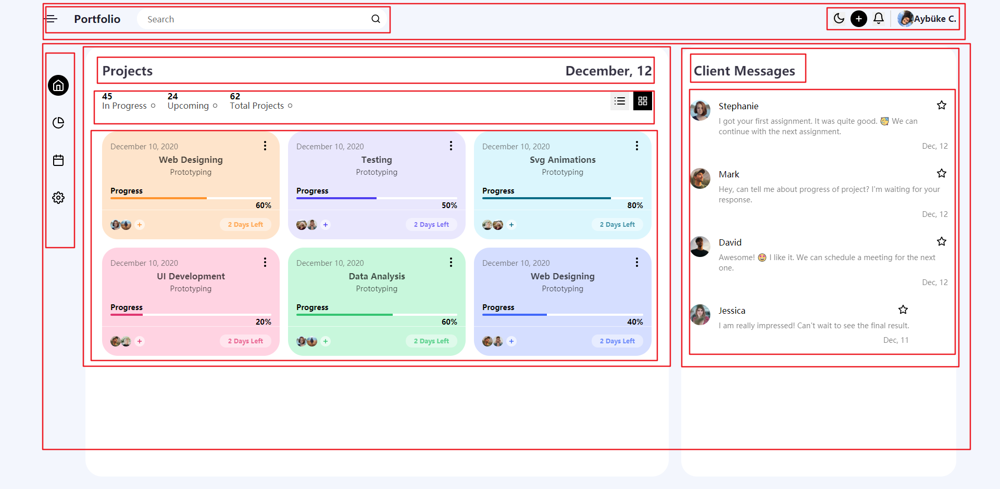

# 横向进度条

本质就是两个背景不一样的两个元素（高度一样，宽度底层元素为 100%，上层元素为特定宽度）

```html
<div class="box-progress-bar">
  <span
    class="box-progress"
    style="width: 60%; background-color: #ff942e"
  ></span>
</div>
```

```css
.box-progress-bar {
  display: flex;
  align-items: center;
  width: 100%;
  height: 4px;
  border-radius: 6px;
  overflow: hidden;
  background-color: #fff;
  margin: 4px 0;
}
.box-progress {
  height: 4px;
}
```

字体五件套：font-size，font-weight，line-height，color，opacity

# 页面布局图

